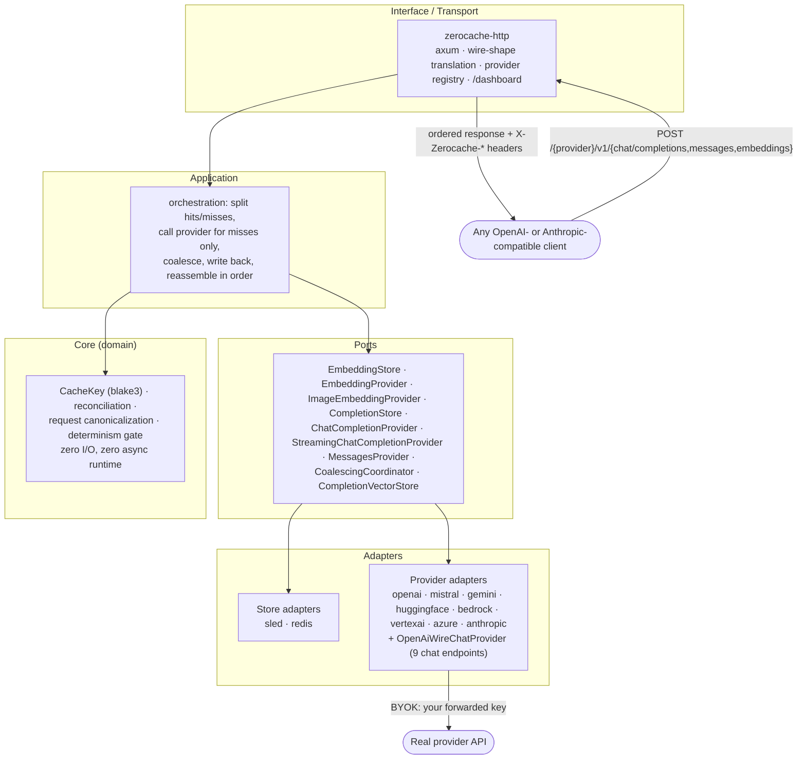

# Zerocache

**A self-hosted caching proxy for LLM and embedding APIs.** Point your existing OpenAI- or Anthropic-compatible client at Zerocache instead of the provider, and repeated chat completions, `/v1/messages` calls, and embeddings come back in **~1 ms** instead of costing another API call.

[](https://github.com/shramanb113/ZeroCache/actions/workflows/ci.yml)
[](https://github.com/shramanb113/ZeroCache/actions/workflows/docker-publish.yml)


```
Your app  ──▶  Zerocache  ──▶  Real provider  (only on a cache miss)
              one base_url swap · your key, per request · no SDK
```

Provider-side prompt caching discounts *input* tokens for a few minutes and **still runs the model**. Zerocache serves the **whole response** — 100 % off input *and* output — for as long as you keep the entry, across runs, across machines. A cache hit is ~1 ms; a cold embedding call is 200–800 ms; a cold LLM call is 1–20 s. On an agent's second pass through the same task, that's the difference between 45 s and 2 s.

No SDK to install. No framework plugin. No server-side provider credentials for Zerocache to hold or leak — every request brings its own key.

---

## Table of contents

- [What it does](#what-it-does)
- [Quickstart](#quickstart)
- [Chat completions](#chat-completions)
- [Embeddings](#embeddings)
- [Live savings dashboard](#live-savings-dashboard)
- [How the cache key works](#how-the-cache-key-works)
- [Architecture](#architecture)
- [Supported providers](#supported-providers)
- [Configuration reference](#configuration-reference)
- [Deployment](#deployment)
- [Observability](#observability)
- [Roadmap](#roadmap)
- [What Zerocache is *not* (yet)](#what-zerocache-is-not-yet)
- [Testing](#testing)
- [Further reading](#further-reading)
- [License](#license)

---

## What it does

Zerocache is one process that sits between your app and every LLM / embedding provider you use.

| Surface | What gets cached | Status |
| --- | --- | --- |
| **`POST /{provider}/v1/chat/completions`** | Whole chat completions, keyed by a canonicalized request body. A hit is 100 % off input **and** output tokens and returns in ~1 ms. | **Live** — exact-match, 9 built-in OpenAI-wire providers, **streaming (`stream: true`) buffered on a miss and replayed on a hit**, deterministic requests only (`temperature: 0` or an explicit `seed`). Optional local-embedder semantic near-match tier (`--features semantic` + `ZEROCACHE_SEMANTIC=1`) — sled in-process, or across replicas on the redis backend via a Redis Stream change-feed. `DELETE` evicts. |
| **`POST /{provider}/v1/messages`** | Whole Anthropic `/v1/messages` completions — Claude's native wire shape, not an OpenAI-compat shim. | **Live** — exact-match, `temperature: 0`-only gate, `anthropic-version` / `anthropic-beta` folded into the key, built-in `anthropic` provider. `stream: true` is a raw passthrough (buffer-and-replay deferred). `DELETE` evicts. |
| **`POST /{provider}/v1/embeddings`** | Embedding vectors, keyed by content + model + tenant. Identical text stops costing a second call. | **Live** — 7 providers, text + image, light text canonicalization (casing / Unicode / punctuation fold to one entry). `DELETE` evicts. |
| **`GET /dashboard`** | — | **Live** — a browser dashboard that polls `/metrics` and shows hit rate, tokens not billed, and an estimated dollar figure, live, per provider. |

Everything is **BYOK**: the caller sends `Authorization: Bearer <their own provider key>` on every request. Zerocache forwards that key upstream on a miss and never stores it — only a hash of it, to keep each caller's cache private.

**Where the savings actually come from** (agreed before building, not marketing):

- **Repeated runs** — CI/eval loops, prompt tuning, re-asks. A full hit is 100 % off; provider prompt caching is an input-only discount on a request that still executes.
- **Auxiliary LLM calls** — the short "summarize this" / "classify that" calls agents fire constantly, which recur verbatim across runs.
- **Retry / flap storms** — a burst of identical requests collapses to one upstream call (in-process coalescing).
- **Multi-agent fan-out** — templated prompts across N workers.
- **RAG re-indexing** — re-embedding a corpus after editing a few documents costs only the deltas.

A measured example from this repo's own agentic battle-test: re-running a 3-ticket support-triage agent suite (10 model calls + 9 tool calls per run) a second time was **100 % cache hits, zero upstream calls, byte-identical resolutions** — ~5.1 k prompt + ~370 completion tokens saved per suite, every intermediate tool-call turn included.

---

## Quickstart

```sh
docker run -d --name zerocache -p 8080:8080 ghcr.io/shramanb113/zerocache:latest
curl http://localhost:8080/health          # -> 200
open http://localhost:8080/dashboard       # live savings view
```

The image is a 14.7 MB `FROM scratch` build — one static musl binary, no shell, no libc, no CA-cert bundle. It runs as a non-root user and ships a built-in `HEALTHCHECK`. No provider key is needed to start it; you supply one per request.

Persist the cache across restarts with a named volume:

```sh
docker run -d --name zerocache -p 8080:8080 -v zerocache-data:/data ghcr.io/shramanb113/zerocache:latest
```

> Named volume (`-v zerocache-data:/data`) inherits the image's `uid 10001` and just works. A **bind mount** to a host path takes that path's ownership — `chown -R 10001:10001` it first, or sled won't open.

**From source** (Rust 1.97.1 via [rustup](https://rustup.rs)):

```sh
cargo run -p zerocache-http    # dashboard at http://localhost:8080/dashboard
```

---

## Chat completions

```
POST /{provider}/v1/chat/completions
Authorization: Bearer <your own key for that provider>

{ "model": "...", "messages": [...], "temperature": 0 }      # OpenAI chat shape, forwarded verbatim on a miss

→ the upstream response body, unchanged           # 200 on a cache hit, served in ~1 ms
  X-Zerocache-Completion-Hit: true | false
```

```sh
# first call: real, billed. second identical call: free, instant.
curl http://localhost:8080/openai/v1/chat/completions \
  -H "Authorization: Bearer sk-your-real-key" \
  -d '{"model":"gpt-4o-mini","messages":[{"role":"user","content":"Summarize: ..."}],"temperature":0}'
```

**`{provider}`** is any name in the chat-provider registry — the built-ins `openai`, `mistral`, `gemini`, `groq`, `deepseek`, `together`, `openrouter`, `xai`, `fireworks` (each a real hosted OpenAI-wire endpoint, registered with zero config), plus anything you add via `ZEROCACHE_CHAT_PROVIDERS="name=url,…"` (self-hosted vLLM/Ollama, an internal gateway).

**What's cached, what's not:**

- Only **deterministic** requests: `temperature == 0` *or* an explicit `seed`, with `n` absent/`1`. Anything else is a transparent passthrough — forwarded, nothing stored, nothing counted.
- The cache key is the **canonicalized** request body: order-independent, and blind to `user` / `stream` / `metadata` / key order / number spelling. Two requests that differ only in those share an entry.
- A **non-2xx** upstream response is forwarded with its real status and **never** cached. Only 2xx is stored.
- Concurrent identical misses within one instance are **coalesced** into a single upstream call — and across replicas when `ZEROCACHE_CROSS_REPLICA_COALESCING=1` on the redis backend.
- **`stream: true` works**: a miss streams the upstream SSE to you live while it's buffered, and on a clean finish stored; a hit replays the stored completion as SSE (`~3 ms` between frames). A `stream: true` and a `stream: false` request for the same deterministic body share one entry. A non-cacheable `stream: true` request is a pure passthrough.
- `DELETE /{provider}/v1/chat/completions` (same body + `Authorization`) evicts the entry a matching `POST` would hit — owner-scoped, idempotent, `{"deleted": 1}`.
- Per-caller namespaced (`owner_id`) and per-endpoint scoped (`cache_scope`), exactly like embeddings — two callers, or the same model string against two different upstreams, never collide.

`X-Zerocache-Completion-Hit: true | false` tells you which path a response took; on a hit, `X-Zerocache-Completion-Hit-Kind: exact | semantic` (and `X-Zerocache-Semantic-Score` on a semantic hit). `/metrics` exposes `zerocache_completion_cache_hits_total` / `_misses_total` / `_prompt_tokens_saved_total` / `_completion_tokens_saved_total`, all `provider`- and `stream`-labeled.

---

## Embeddings

```
POST /{provider}/v1/embeddings
Authorization: Bearer <your own key for that provider>

{ "model": "<real upstream model>", "input": ["text 1", "text 2"] }   # or a single bare string

→ { "object": "list", "data": [ { "embedding": [...], "index": 0 }, ... ], "model": "...", "usage": {...} }
  X-Zerocache-Hits / X-Zerocache-Misses
```

`{provider}` is one of `openai`, `mistral`, `gemini`, `huggingface`, `bedrock`, `vertexai`, `azure`. `input` accepts a JSON array **or** a single bare string (OpenAI's real `string | string[]` contract), so `embedQuery()`-style calls from LangChain / LlamaIndex work unmodified.

- Inputs differing only in **casing / Unicode form / quote-dash style / trailing sentence punctuation** fold to one cache entry (the vector stored under it is still a real embedding of some caller's actual text).
- **Image embeddings** (Gemini only): `POST /gemini/v1/images/embeddings` with `input` as `data:<mime>;base64,<…>` URIs. Every other provider `404`s.
- **Cloud provider routing** — Azure / Bedrock / Vertex AI encode region / project / task-type in the `model` string (no new wire field, since `model` is already free-form and part of the key):

  | provider | grammar | example |
  | --- | --- | --- |
  | `bedrock` | `[<region>/]<modelId>[#<input_type>]` | `us-east-1/cohere.embed-english-v3#search_query` |
  | `vertexai` | `[<location>/<project>/]<modelId>[#<task_type>]` | `us-central1/my-proj/text-embedding-005#RETRIEVAL_DOCUMENT` |
  | `azure` | `[foundry:]<deployment>[#<input_type>]` | `foundry:cohere-embed-v3-english#document` |

- `DELETE /{provider}/v1/embeddings` (same body) drops the entries a matching `POST` would hit, scoped to your `owner_id`. Response `{"deleted": <count>}`, idempotent.
- Optional `ZEROCACHE_TTL_SECONDS` sets a per-entry expiry (unset = never).

---

## Live savings dashboard

`GET /dashboard` — an Astro + React + Recharts single-page app **embedded in the binary**, served on the same origin as `/metrics` (no CORS, no config). It polls `/metrics` every 2 s and shows:

- estimated **total cost avoided** since the process started (completions measured exactly from the stored `usage` block; embeddings estimated from `hits × avg tokens per observed miss`);
- hit rate per cache, tokens not billed, a per-provider table;
- a session chart of cost avoided over time, with editable per-provider prices (`$/Mtok`, persisted in the browser).

Screenshot this mid-run. It's the artifact.

---

## How the cache key works

**Chat:** `owner_id + provider + cache_scope + model + adapter_version + canonicalize_completion_request(body)`, domain-separated by a `"chat-completion\0"` literal.

**Embeddings:** `blake3(owner_id + provider + cache_scope + model + model_version + canonicalize_text(text))`; image path is domain-separated by `"image\0"`.

- **`owner_id`** — `blake3` of your forwarded API key (never the raw key). Two callers never share an entry, even for identical input.
- **`provider` + `model` + `model_version`** — a different provider, model, or adapter version can never silently hand back a stale-but-plausible vector or completion.
- **`cache_scope`** — the configured endpoint identity. Repointing `ZEROCACHE_OPENAI_BASE_URL` at a self-hosted vLLM starts a cold cache, never a wrong hit; `us-east-1` and `eu-west-1` Bedrock, or two GCP projects, never collide even when the `model` string looks identical.

---

## Architecture

Dependencies point inward only — enforced by Cargo workspace crate boundaries, not convention.



| Crate | Responsibility |
| --- | --- |
| `zerocache-core` | Domain: cache-key derivation, hit/miss reconciliation, request canonicalization, the completion determinism gate. No I/O, no async, no framework awareness. |
| `zerocache-ports` | Trait contracts: `EmbeddingStore` / `EmbeddingProvider` / `ImageEmbeddingProvider` / `CompletionStore` / `ChatCompletionProvider` / `StreamingChatCompletionProvider` / `MessagesProvider` / `CoalescingCoordinator` / `CompletionVectorStore`. |
| `zerocache-adapters-sled` | Embedded store (sled). Local dev / single instance. |
| `zerocache-adapters-redis` | Shared store (Redis, pooled, no distributed lock). Any multi-replica deployment. |
| `zerocache-adapters-openai` | OpenAI embeddings **+** `OpenAiWireChatProvider` — the generic OpenAI-wire chat proxy behind all 9 chat providers. |
| `zerocache-adapters-{mistral,gemini,huggingface}` | Embedding providers (`gemini` also does image embeddings). |
| `zerocache-adapters-cloud` | Shared kit for the three cloud adapters: transport driver + a `CloudRouter` / `TextWireStrategy` strategy pattern (each cloud fronts several model vendors). |
| `zerocache-adapters-{bedrock,vertexai,azure}` | Embedding providers for Amazon Bedrock, GCP Vertex AI, Azure (OpenAI GA + Foundry). |
| `zerocache-adapters-anthropic` | `MessagesProvider` — Claude's native `/v1/messages` wire shape. |
| `zerocache-semantic` | The opt-in semantic near-match tier (candle + a bundled all-MiniLM-L6-v2). **Not** a `--workspace` member — pulled in only by `zerocache-http --features semantic`. |
| `zerocache-http` | axum server, wire translation, provider registry, application wiring, the embedded dashboard. |

---

## Supported providers

**Chat completions** (`/{provider}/v1/chat/completions`) — all OpenAI-wire, zero config:
`openai` · `mistral` · `gemini` · `groq` · `deepseek` · `together` · `openrouter` · `xai` · `fireworks`, plus any name added via `ZEROCACHE_CHAT_PROVIDERS`.

**Anthropic Messages** (`/{provider}/v1/messages`) — Claude's native wire shape:
`anthropic` (built-in → `https://api.anthropic.com`), plus any name added via `ZEROCACHE_MESSAGES_PROVIDERS`.

**Embeddings** (`/{provider}/v1/embeddings`):

| `{provider}` | Text | Image | Notes |
| --- | :---: | :---: | --- |
| `openai` | ✅ | — | Configurable base URL — self-hosted vLLM / LM Studio work too. |
| `mistral` | ✅ | — | Configurable base URL. |
| `gemini` | ✅ | ✅ | Only provider with image embeddings. Never reports token usage. |
| `huggingface` | ✅ | — | Model is in the URL path, not the body — a real wire-shape difference. |
| `bedrock` | ✅ | — | Amazon bearer API keys — no AWS SigV4. Titan + Cohere behind one router. |
| `vertexai` | ✅ | — | GCP native `:predict` endpoint. |
| `azure` | ✅ | — | Azure OpenAI GA `/openai/v1` **and** Foundry Models. Registers only if a base-URL env var is set. |

---

## Configuration reference

Every setting is an environment variable — no config file. Everything is optional.

**Core**

| Variable | Default | Notes |
| --- | --- | --- |
| `ZEROCACHE_PORT` | `8080` | Binds `0.0.0.0`. |
| `ZEROCACHE_STORAGE_BACKEND` | `sled` | `sled` or `redis`. |
| `ZEROCACHE_STORAGE_PATH` | `./data` (`/data` in Docker) | sled only. |
| `ZEROCACHE_REDIS_URL` | `redis://127.0.0.1:6379` | redis only. |
| `ZEROCACHE_TTL_SECONDS` | unset (never expires) | Per-entry expiry. `0` / unparseable → unset + startup warning. |
| `ZEROCACHE_CROSS_REPLICA_COALESCING` | unset (off) | Opt-in (`1`/`true`/`yes`); **redis backend only** (set on sled → startup warning, no-op). Redis-lock single-flight so N replicas make one upstream call for the same single-key miss (any chat completion; a one-`input` embedding). A follower that waits and then still has to call upstream can take up to ~60 s (30 s wait + its own 30 s provider timeout). |

**Chat & messages providers**

| Variable | Default | Notes |
| --- | --- | --- |
| `ZEROCACHE_CHAT_PROVIDERS` | unset | `"name=url,name=url"` — override a built-in's URL or add a new provider. The URL is the prefix *up to but not including* `/chat/completions` (so Gemini's `…/v1beta/openai` works). Malformed entries are skipped with a warning, never blocking startup. Independent of `ZEROCACHE_OPENAI_BASE_URL`, which is embeddings-only. |
| `ZEROCACHE_MESSAGES_PROVIDERS` | unset | `"name=url,name=url"` — override or add an Anthropic `/v1/messages` provider. Unlike the chat var, each URL is a **bare origin** — the adapter appends `/v1/messages` itself. |

**Semantic tier** (`--features semantic` build only)

| Variable | Default | Notes |
| --- | --- | --- |
| `ZEROCACHE_SEMANTIC` | unset (off) | `1` enables the local-embedder near-match tier. Embedder-load failure with it on is fail-fast (`exit 1`). |
| `ZEROCACHE_SEMANTIC_THRESHOLD` | `0.97` | Cosine acceptance threshold, clamped to `[0.5, 1.0]`. The threshold, not the embedder, bounds false positives. |
| `ZEROCACHE_SEMANTIC_MATCH_UNIT` | `last-user` | Which span is fuzzy-matched: `last-user` \| `system-and-last-user` \| `full-conversation`. Everything else stays exact. |
| `ZEROCACHE_SEMANTIC_POLL_MS` | `2000` | redis backend: `XREAD BLOCK` ceiling for the cross-replica index change-feed, clamped `[250, 60000]`. |
| `ZEROCACHE_SEMANTIC_INDEX_MAXLEN` | `100000` | redis backend: `MAXLEN ~` cap on the `zerocache:semantic:events` stream. |

**Embedding provider base URLs** — a bare origin (scheme + host + optional port), **no** `/v1`, **no** trailing slash:

| Variable | Default |
| --- | --- |
| `ZEROCACHE_OPENAI_BASE_URL` | `https://api.openai.com` |
| `ZEROCACHE_MISTRAL_BASE_URL` | `https://api.mistral.ai` |
| `ZEROCACHE_GEMINI_BASE_URL` | `https://generativelanguage.googleapis.com` |
| `ZEROCACHE_HUGGINGFACE_BASE_URL` | `https://router.huggingface.co/hf-inference` |

**Azure** — `ZEROCACHE_AZURE_OPENAI_BASE_URL`, `_AZURE_FOUNDRY_BASE_URL`, `_AZURE_FOUNDRY_API_VERSION` (`2024-05-01-preview`), `_AZURE_AUTH_MODE` (`bearer` | `api-key`). Setting either base URL registers the `azure` provider.
**Bedrock** — `ZEROCACHE_BEDROCK_REGION` (`us-east-1`), `_BEDROCK_ENDPOINT_TEMPLATE`.
**Vertex AI** — `ZEROCACHE_VERTEX_PROJECT` (unset → `model` must carry `<location>/<project>/`), `_VERTEX_LOCATION` (`us-central1`), `_VERTEX_ENDPOINT_TEMPLATE`.
**Observability** — `OTEL_EXPORTER_OTLP_ENDPOINT` (unset → console only), `RUST_LOG` (`info`).

---

## Deployment

**Docker image** — multi-stage build (`Dockerfile`): a `node:22` stage builds the dashboard from source, `cargo-chef` caches the dependency layer, the Rust builder produces a **static `x86_64-unknown-linux-musl`** binary (rustls, no OpenSSL), and the runtime stage is `FROM scratch` — just that binary. ~14.7 MB. Published to GHCR on every green `master`:

```sh
docker pull ghcr.io/shramanb113/zerocache:latest
docker pull ghcr.io/shramanb113/zerocache:<commit-sha>
docker pull ghcr.io/shramanb113/zerocache:semantic       # same image + the semantic tier compiled in
```

**Kubernetes / multi-replica** — the default `sled` store is per-process, so replicas don't share hits. Set `ZEROCACHE_STORAGE_BACKEND=redis` + `ZEROCACHE_REDIS_URL` for a shared cache (no distributed lock needed for correctness — content-addressed keys make last-write-wins safe; set `ZEROCACHE_CROSS_REPLICA_COALESCING=1` to also dedupe concurrent identical single-key misses across replicas, saving the duplicate upstream calls). `/health` + `/ready` are standard liveness/readiness probes; scrape `/metrics` per pod and `sum()`.

**CI/CD** — `ci.yml` runs `build` / `test` / `test-redis` / `build-musl` / `build-semantic` / `clippy -D warnings` / `fmt` / `dashboard` on every push and PR to `master`; `docker-publish.yml` builds and pushes the `:latest` and `:semantic` images after CI passes on a genuine push (not on fork PRs).

---

## Observability

- **`GET /metrics`** — Prometheus text, labeled by `provider` and `content_type`. `zerocache_cache_hits_total` / `_misses_total` / `zerocache_provider_prompt_tokens_total` for embeddings; `zerocache_completion_cache_hits_total` / `_misses_total` / `_prompt_tokens_saved_total` / `_completion_tokens_saved_total` for chat. No tenant label — that would leak identity into monitoring and blow up cardinality.
- **`GET /health`** — zero-I/O liveness.
- **`GET /ready`** — calls the store's `get()` on a reserved sentinel key; `503` on a store-level error.
- **OpenTelemetry** — set `OTEL_EXPORTER_OTLP_ENDPOINT` for OTLP/gRPC export. Every request gets a span with `store_lookup` / `provider_call` / `store_write_back` children and `hits` / `misses` / `claimed` / `piggybacked` fields.

---

## Roadmap

The features that make the completion cache a general LLM gateway, roughly in order:

1. **Semantic completion cache** — ✅ **Live (opt-in).** A local candle embedder (all-MiniLM-L6-v2, compiled in) generates a prompt vector; on an exact-match miss a hit is a cosine match above a conservative threshold *and* a byte-for-byte match of the rest of the request. Turns a near-zero hit rate on paraphrased chatbot/agent traffic into a useful one. Build with `--features semantic`, enable with `ZEROCACHE_SEMANTIC=1`. Works on both backends: sled in-process, or a Redis Stream change-feed across replicas — set `ZEROCACHE_STORAGE_BACKEND=redis` (needs Redis ≥ 6.2); ~2 s cross-replica propagation lag, tune with `ZEROCACHE_SEMANTIC_POLL_MS`, size the feed with `ZEROCACHE_SEMANTIC_INDEX_MAXLEN`. The threshold, not the embedder, bounds false positives.
2. **Cross-replica request coalescing** — ✅ **Live (opt-in).** With `ZEROCACHE_CROSS_REPLICA_COALESCING=1` on the redis backend, two replicas missing on the same single `CacheKey` (any chat completion, or a one-`input` embedding request) share one upstream call via a Redis lock. Multi-item embedding batches and images stay in-process only.
3. **Streaming** — ✅ **Live.** `stream: true` on the OpenAI-wire chat surface: the SSE is buffered on a miss (streamed to the caller live meanwhile) and replayed frame-by-frame on a hit. One entry serves both `stream: true` and `stream: false`. Anthropic `/v1/messages` streaming is still a raw passthrough.
4. **Anthropic `/v1/messages`** — ✅ **Live.** A native adapter for Claude's wire shape (`POST` / `DELETE /{provider}/v1/messages`), `temperature: 0`-only cache gate, `anthropic-version` / `anthropic-beta` folded into the key. Non-streaming; the `--features semantic` near-match tier for this surface is deferred.
5. **Budgets & rate limits** — per-key monthly spend caps (`429` when exceeded) and per-key RPS limits, with a cost-by-team view in the dashboard.
6. **Multi-provider failover** — retry a failed request on a second configured provider (the adapters already exist; only the routing policy is missing).
7. **Request log + replay** (opt-in) — persist request/response pairs, browse them, replay one, diff the result.
8. **One-click deploy** — `fly.toml` / a Deploy button, and a hosted free tier.

---

## What Zerocache is *not* (yet)

- **Semantic chat caching is opt-in** — a `--features semantic` build plus `ZEROCACHE_SEMANTIC=1` adds a local-embedder near-match tier; the default build is still exact-match on a canonicalized body. On the redis backend it propagates across replicas via a Redis Stream change-feed with a blocking (`XREAD BLOCK`) reader; the RediSearch-native KNN path is still deferred. The semantic tier does not cover the Anthropic `/v1/messages` surface or image embeddings.
- **Anthropic `/v1/messages` streaming is a raw passthrough** — `stream: true` on that surface is forwarded uncached; buffer-and-replay (which the OpenAI-wire chat surface has) is deferred.
- **No budgets, rate limiting, or failover** — roadmap items 5–6.
- **No fuzzy similarity on embedding vectors** — and it never will do that: finding a near neighbour requires computing the very embedding you're trying to avoid. Text canonicalization (casing/punctuation fold) is the only near-match on the embedding path.
- **No quantization / eviction** — deferred until a real hit-rate number justifies the work.
- **No Zerocache SDK** — if a consumer has to install a package, the "drop-in" promise has failed.
- **Cloud adapters (Azure / Bedrock / Vertex AI) are mock-tested only** — every wire shape was verified against each vendor's live docs, but none has had a live-key smoke test in this environment. Run one against your own credentials before production.

---

## Testing

450+ tests across the 14 workspace crates and the opt-in `zerocache-semantic` crate, plus a 30-test `#[ignore]`d real-Redis integration suite (ephemeral container via `testcontainers`), zero `clippy -D warnings` findings.

1. **Core** — pure unit tests: key derivation, owner/provider/scope isolation, image domain-separation, the completion canonicalizer + determinism gate.
2. **Application** — orchestration against mock ports: hit/miss splitting, ordering, coalescing (text, image, completion), within-batch dedup, cache-scope isolation, failure propagation.
3. **Adapters** — `sled` against a real store; every provider adapter against `httpmock`; Redis against a real container.
4. **End-to-end, real consumers** — a TS/Mastra RAG pipeline (including an *agentic* battle-test driving Zerocache through `Agent` tool calls), a second independent TS project on LangChain, a Python/LlamaIndex pipeline against Gemini, and a real ReAct tool-calling agent against the completion cache — the "any framework, any language" claim proven, not asserted.

Live smoke-tested against Gemini's OpenAI-compatible endpoint for both the completion cache and the embedding path.

---

## Further reading

- **[`CLAUDE.md`](./CLAUDE.md)** — full architecture and a dated log of every deviation from the original spec, with rationale.
- **[`decisions.md`](./decisions.md)** — the reasoning behind the multi-tenant, multi-provider, BYOK design.
- **[`PRD.md`](./PRD.md)** — the original product spec and phasing.

Development loop (exactly what CI runs):

```sh
cargo build --workspace
cargo test --workspace
cargo clippy --workspace --all-targets -- -D warnings
cargo fmt --check
```

---

## License

No license file exists yet — until one is added, treat the code as all-rights-reserved.
